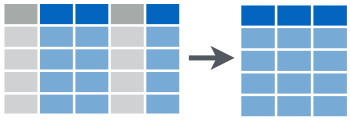
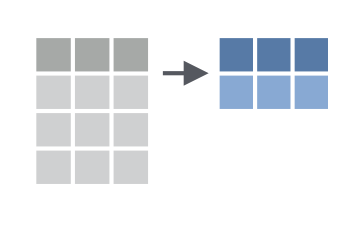
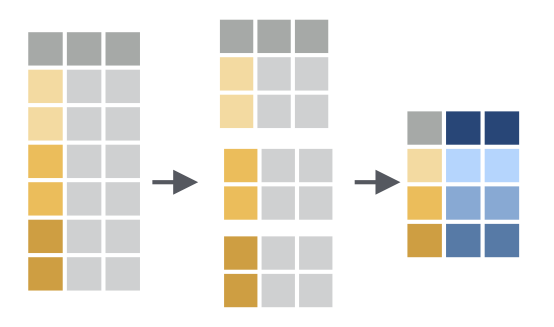

```{r setup, include=FALSE}
knitr::opts_chunk$set(echo = TRUE)
```

# Load Packages

Load the `tidyverse` package. 

```{r}
library(tidyverse)
```

# Import NHANES Data

Import the NHANES data to a data frame called `nhanes`. 

```{r}
nhanes <- read_csv("data/nhanes.csv")
```


# select



With `select` we can select variables from the larger data frame. 

Use `select` to show just the `marital_status` variable.

```{r}
nhanes %>% 
    select(marital_status)
```


We can also use `select` for multiple variables. 

Use `select` to show `marital_status` and `education`.

```{r}
nhanes %>% 
    select(marital_status, education)
```

We can `select` a range of columns using the var1:var2 pattern. `select` all the variables from `health_gen` to the end.


```{r}
# You can do this in two ways. You can do it by selecting from health_gen to the last variable, which is smoke_now.

nhanes %>% 
    select(health_gen:smoke_now)

# You can also do this by using the last_col() function, which returns the name of the last column.

nhanes %>% 
    select(health_gen:last_col())
```

We can drop variables using the -var format. Drop the `education` variable.


```{r}
nhanes %>% 
    select(-education)
```

We can drop a set of variables using the -(var1:var2) format. Drop the variables from `health_gen` to the end.


```{r}
# Again, two options

nhanes %>% 
    select(-(health_gen:smoke_now))

nhanes %>% 
    select(-(health_gen:last_col()))
```

# mutate


We use `mutate` we make new variables or change existing ones. 

Create a **new variable with a specific value**

Create a new variable called `completed_survey` and make all responses to it "Yes". If you want to see this variable easily, add a line where you select only the `completed_survey` variable. Don't forget the pipe (%>%)!

```{r}
nhanes %>% 
    mutate(completed_survey = "Yes") %>% 
    select(completed_survey)
```


Create a **new variable based on other variables**

Create a new variable called `pct_days_phys_health_bad` and calculate it as the percentage of self-reported days of bad physical health in the last 30 days. Remember that the `days_phys_hlth_bad` variable is a measure of the **number** of self-reported days of bad physical health in the last 30 days. Then, use `select` to show the `days_phys_hlth_bad` and `pct_days_phys_health_bad` variables.

```{r}
nhanes %>% 
    mutate(pct_days_phys_health_bad = days_phys_hlth_bad / 30) %>% 
    select(days_phys_hlth_bad, pct_days_phys_health_bad)
```

Change an **existing variable**

Convert the `weight` variable to pounds by multiplying by 2.205 (it's in kilograms now). Then, use `select` to show only the `weight` variable.

```{r}
nhanes %>% 
    mutate(weight = weight * 2.205) %>% 
    select(weight)
```


# filter


We use `filter` to choose a subset of cases.

Use `filter` to keep only respondents who are divorced. Then, use `select` to show only the `marital_status` variable.

```{r}
nhanes %>% 
    filter(marital_status == "Divorced") %>% 
    select(marital_status)
```

Use `filter` to keep only respondents who are **not** divorced. Then, use `select` to show only the `marital_status` variable.

```{r}
nhanes %>% 
    filter(marital_status != "Divorced") %>% 
    select(marital_status)
```


Use `%in%` within the `filter` function to keep only those who are divorced, separated, or widowed. Then, use `select` to show only the `marital_status` variable.

```{r}
nhanes %>% 
    filter(marital_status %in% c("Divorced", "Separated", "Widowed")) %>% 
    select(marital_status)
```

Create a chain that keeps only those are college grads (line #1). Then, `filter` to keep only those who are divorced, separated, or widowed. Finally, use `select` to show only the `education` and `marital_status` variables.

```{r}
nhanes %>% 
    filter(education == "College Grad") %>% 
    filter(marital_status %in% c("Divorced", "Separated", "Widowed")) %>% 
    select(education, marital_status)
```


We can use `<`, `>`, `<=`, and `>=` for numeric data. 

Use `filter` to only show those who reported at least 5 days of physical activity in the last 30 days (this is the `phys_active_days` variable). Then, use `select` to keep only the `phys_active_days` variable.

```{r}
nhanes %>% 
    filter(phys_active_days >= 5) %>% 
    select(phys_active_days)
```


# summarize




With `summarize`, we can go from a complete dataset down to a summary.

Get the mean hours of sleep per night that respondents say they get.

```{r}
nhanes %>% 
    summarize(mean_sleep = mean(sleep_hrs_night,
                                na.rm = TRUE))
```


We can have multiple arguments in each usage of `summarize`.

In addition to calculating the mean hours of sleep per night, calculate the minimum and maximum hours of sleep that respondents reported.

```{r}
nhanes %>% 
    summarize(mean_sleep = mean(sleep_hrs_night,
                                na.rm = TRUE),
              min_sleep = min(sleep_hrs_night,
                                na.rm = TRUE),
              max_sleep = max(sleep_hrs_night,
                                na.rm = TRUE))
```


# group_by




`summarize` becomes truly powerful when paired with `group_by`, which enables us to perform calculations on each group. 

Calculate the mean hours of sleep for females and males using `group_by` and `summarize`.

```{r}
nhanes %>% 
    group_by(gender) %>% 
    summarize(mean_sleep = mean(sleep_hrs_night,
                                na.rm = TRUE))
````

We can use `group_by` with multiple groups.

Use `group_by` for `gender` and `work` (whether or not respondents are working) before calculating mean hours of sleep.

```{r}
nhanes %>% 
    group_by(gender, work) %>% 
    summarize(mean_sleep = mean(sleep_hrs_night,
                                na.rm = TRUE))
```


# Create a new data frame

Sometimes you want to save the results of your work to a new data frame. 

Create a chain that starts with your `nhanes` data frame, does the following, and saves the result to a new data frame called `mental_health_over_30`:

1. Uses `filter` to only include those age 30 or older
2. Uses `group_by` to create a male and female group
3. Uses `summarize` to calculate a new variable called `mean_bad_mental_health_days` for males and females that calculates the mean number of days of bad mental health (the variable is `days_ment_hlth_bad`).

```{r}
mental_health_over_30 <- nhanes %>% 
    filter(age >= 30) %>% 
    group_by(gender) %>% 
    summarize(mean_bad_mental_health_days = mean(days_ment_hlth_bad,
                                                 na.rm = TRUE))
```


