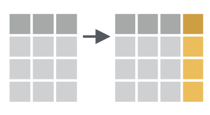
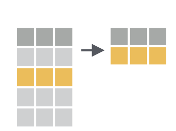

```{r setup, include=FALSE}
knitr::opts_chunk$set(echo = TRUE)
```

# Load Packages

Load the `tidyverse` package. 

```{r}
library(tidyverse)
```

# Import NHANES Data

Import the NHANES data to a data frame called `nhanes`. 

```{r}
nhanes <- read_csv("data/nhanes.csv")
```


# select


With `select` we can select variables from the larger data frame. 

Use `select` to show just the `marital_status` variable.

```{r}
nhanes %>% 
    select(marital_status)
```


We can also use `select` for multiple variables. 

Use `select` to show `marital_status` and `education`.

```{r}
nhanes %>% 
    select(marital_status, education)
```

We can drop variables using the -var format. Drop the `education` variable.

```{r}
nhanes %>% 
    select(-education)
```


# mutate



We use `mutate` we make new variables or change existing ones. 

Create a **new variable with a specific value**

Create a new variable called `completed_survey` and make all responses to it "Yes". If you want to see this variable easily, add a line where you select only the `completed_survey` variable. Don't forget the pipe (%>%)!

```{r}
nhanes %>% 
    mutate(completed_survey = "Yes") %>% 
    select(completed_survey)
```


Create a **new variable based on other variables**

Create a new variable called `pct_days_phys_health_bad` and calculate it as the percentage of self-reported days of bad physical health in the last 30 days. Remember that the `days_phys_hlth_bad` variable is a measure of the **number** of self-reported days of bad physical health in the last 30 days. Then, use `select` to show the `days_phys_hlth_bad` and `pct_days_phys_health_bad` variables.

```{r}
nhanes %>% 
    mutate(pct_days_phys_health_bad = days_phys_hlth_bad / 30) %>% 
    select(days_phys_hlth_bad, pct_days_phys_health_bad)
```

Change an **existing variable**

Convert the `weight` variable to pounds by multiplying by 2.205 (it's in kilograms now). Then, use `select` to show only the `weight` variable.

```{r}
nhanes %>% 
    mutate(weight = weight * 2.205) %>% 
    select(weight)
```


# filter



We use `filter` to choose a subset of cases.

Use `filter` to keep only respondents who are divorced. Then, use `select` to show only the `marital_status` variable.

```{r}
nhanes %>% 
    filter(marital_status == "Divorced") %>% 
    select(marital_status)
```

Use `filter` to keep only respondents who are **not** divorced. Then, use `select` to show only the `marital_status` variable.

```{r}
nhanes %>% 
    filter(marital_status != "Divorced") %>% 
    select(marital_status)
```


Use `%in%` within the `filter` function to keep only those who are divorced, separated, or widowed. Then, use `select` to show only the `marital_status` variable.

```{r}
nhanes %>% 
    filter(marital_status %in% c("Divorced", "Separated", "Widowed")) %>% 
    select(marital_status)
```

Create a chain that keeps only those are college grads (line #1). Then, `filter` to keep only those who are divorced, separated, or widowed. Finally, use `select` to show only the `education` and `marital_status` variables.

```{r}
nhanes %>% 
    filter(education == "College Grad") %>% 
    filter(marital_status %in% c("Divorced", "Separated", "Widowed")) %>% 
    select(education, marital_status)
```


We can use `<`, `>`, `<=`, and `>=` for numeric data. 

Use `filter` to only show those who reported at least 5 days of physical activity in the last 30 days (this is the `phys_active_days` variable). Then, use `select` to keep only the `phys_active_days` variable.

```{r}
nhanes %>% 
    filter(phys_active_days >= 5) %>% 
    select(phys_active_days)
```


# summarize


With `summarize`, we can go from a complete dataset down to a summary.

Get the mean hours of sleep per night that respondents say they get.

```{r}
nhanes %>% 
    summarize(mean_sleep = mean(sleep_hrs_night,
                                na.rm = TRUE))
```


# group_by


`summarize` becomes truly powerful when paired with `group_by`, which enables us to perform calculations on each group. 

Calculate the mean hours of sleep for females and males using `group_by` and `summarize`.

```{r}
nhanes %>% 
    group_by(gender) %>% 
    summarize(mean_sleep = mean(sleep_hrs_night,
                                na.rm = TRUE))
````

