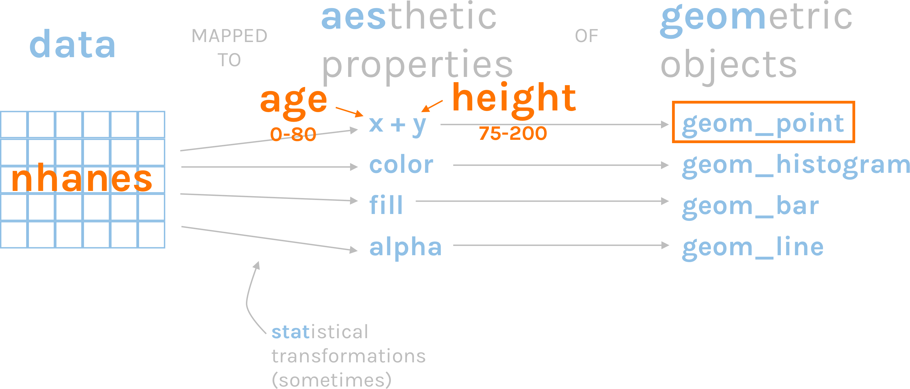
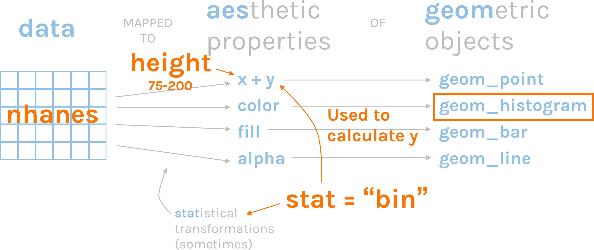
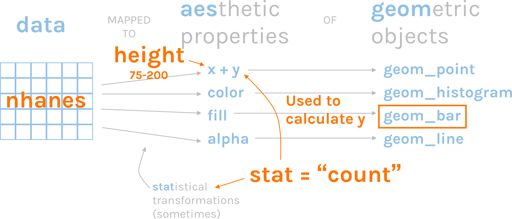
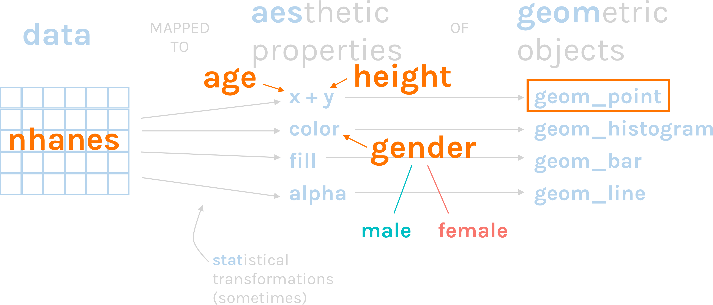

```{r setup, include=FALSE}
knitr::opts_chunk$set(echo = TRUE)
```


# Load Packages

Let's load the `tidyverse` package. 

```{r}
library(tidyverse)
```

# Import NHANES Data

Let's import our data using `read_csv`. 

```{r}
nhanes <- read_csv("data/nhanes.csv")
```

# ggplot template

```{r eval = FALSE}
ggplot(data = data_frame,
       mapping = aes(x = x_variable,
                     y = y_variable)) +
  geom_something()
```


# Scatterplot

We use `geom_point` to make a scatterplot. Let's make a scatterplot that shows age on the x axis and height on the y axis.

```{r}
ggplot(data = nhanes,
       mapping = aes(x = age,
                     y = height)) +
  geom_point()
```

Let's take a look at what's going on here.




# Histogram 

We use `geom_histogram` to make a histogram. Let's make a histogram of height.

```{r}
ggplot(data = nhanes, 
       mapping = aes(x = height)) +
  geom_histogram()
```


How does ggplot know what to plot on the y axis? It's using the default statistical transformation for `geom_histogram`, which is `stat = "bin"`.




If we add `stat = "bin"` we get the same thing. Each geom has a default stat.

```{r}
ggplot(data = nhanes, 
       mapping = aes(x = height)) +
  geom_histogram(stat = "bin")
```

We can adjust the number of bins using the `bins` argument. 

```{r}
ggplot(data = nhanes, 
       mapping = aes(x = height)) +
  geom_histogram(bins = 100)
```


# Bar Chart

There are two basic approaches to making bar charts, both of which use `geom_bar`.

**Approach #1**

Use your full dataset.

Only assign a variable to the x axis.

Let ggplot use the default `stat` transformation (`stat = "count"`) to generate counts that it then plots on the y axis.

**Approach #2**

Wrangle your data frame before plotting, possibly creating a new data frame in the process

Assign variables to the x and y axes

Use `stat = "identity"` to tell ggplot to use the data exactly as it is


## Bar Chart v1

Let's make a bar chart that shows height.


```{r}
ggplot(data = nhanes, 
       mapping = aes(x = height)) +
  geom_bar()
```


The default statistical transformation for `geom_bar` is `count`. This will give us the same result as our previous plot.

```{r}
ggplot(data = nhanes, 
       mapping = aes(x = height)) +
  geom_bar(stat = "count") 
```

Here's what's going on.




## Bar Chart v2

It's often easier to do our analysis work, save a data frame, and then use this to plot.

Let's make a `female_height_inches_by_age` data frame. Note that I am using the `drop_na` function to, well, drop NA values.

```{r}
female_height_inches_by_age <- nhanes %>% 
  filter(gender == "female") %>% 
  mutate(height_inches = height / 2.54) %>% 
  group_by(age_decade) %>% 
  summarize(height_inches = mean(height_inches,
                                 na.rm = TRUE)) %>% 
  drop_na(age_decade)
```


Then let's use this data frame to make a bar chart. The `stat = "identity"` here tells ggplot to use the exact data points without any `stat` transformations.

```{r}
ggplot(data = female_height_inches_by_age, 
       mapping = aes(x = age_decade, 
                     y = height_inches)) +
  geom_bar(stat = "identity") 
```


# `color` and `fill`

## color

We add the color argument *within* the `aes` so that the data in that variable is mapped to those aesthetic properties. Let's add different colors for males and males to our previous scatterplot.

```{r}
ggplot(data = nhanes,
       mapping = aes(x = age,
                     y = height,
                     color = gender)) + 
  geom_point()
```

Note that each option in the gender variable (male and female) is mapped to a color (male = teal, female = red).



Let's try the same thing with our last bar chart. 

```{r}
ggplot(data = female_height_inches_by_age, 
       mapping = aes(x = age_decade, 
                     y = height_inches,
                     color = age_decade)) +
  geom_bar(stat = "identity") 
```

That didn't work! Let's try `fill` instead.

```{r}
ggplot(data = female_height_inches_by_age, 
       mapping = aes(x = age_decade, 
                     y = height_inches,
                     fill = age_decade)) +
  geom_bar(stat = "identity") 
```


# Plot Labels

To add labels to our plot, we use `labs`. We can a title to the plot with the `title` argument. Let's take our last scatterplot and add a title. 

```{r}
ggplot(data = nhanes,
       mapping = aes(x = age,
                     y = height,
                     color = gender)) + 
  geom_point() +
  scale_color_viridis_d(option = "plasma") +
  labs(title = "Association Between Age and Height")
```

We can add a `subtitle` as well.

```{r}
ggplot(data = nhanes,
       mapping = aes(x = age,
                     y = height,
                     color = gender)) + 
  geom_point() +
  scale_color_viridis_d(option = "plasma") +
  labs(title = "Association Between Age and Height",
       subtitle = "Data from NHANES")
```


We can change the x and y axis labels using the `x` and `y` arguments.

```{r}
ggplot(data = nhanes,
       mapping = aes(x = age,
                     y = height,
                     color = gender)) + 
  geom_point() +
  scale_color_viridis_d(option = "plasma") +
  labs(title = "Association Between Age and Height",
       subtitle = "Data from NHANES",
       x = "Age",
       y = "Height (cm)")
```

To change the title above the legend, we use the name of the aesthetic that is being shown.

```{r}
ggplot(data = nhanes,
       mapping = aes(x = age,
                     y = height,
                     color = gender)) + 
  geom_point() +
  scale_color_viridis_d(option = "plasma") +
  labs(title = "Association Between Age and Height",
       subtitle = "Data from NHANES",
       x = "Age",
       y = "Height (cm)",
       color = "Gender")
```

# Themes

To add a theme to a plot, we use the `theme_` set of functions. There are several built-in themes. For instance, `theme_minimal`.

```{r}
ggplot(data = nhanes,
       mapping = aes(x = age,
                     y = height,
                     color = gender)) + 
  geom_point() +
  scale_color_viridis_d(option = "plasma") +
  labs(title = "Association Between Age and Height",
       subtitle = "Data from NHANES",
       x = "Age",
       y = "Height (cm)",
       color = "Gender") +
  theme_minimal()
```


# Facets

One of the most powerful features of ggplot is facetting. You can make small multiples by adding just a line of code using the `facet_wrap` function. Let's make two separate scatterplots from our example above (one for males, one for females).

```{r}
ggplot(data = nhanes,
       mapping = aes(x = age,
                     y = height,
                     color = gender)) + 
  geom_point() +
  labs(title = "Association Between Age and Height",
       subtitle = "Data from NHANES",
       x = "Age",
       y = "Height (cm)",
       color = "Gender") +
  theme_minimal() +
  facet_wrap(~gender)
```

