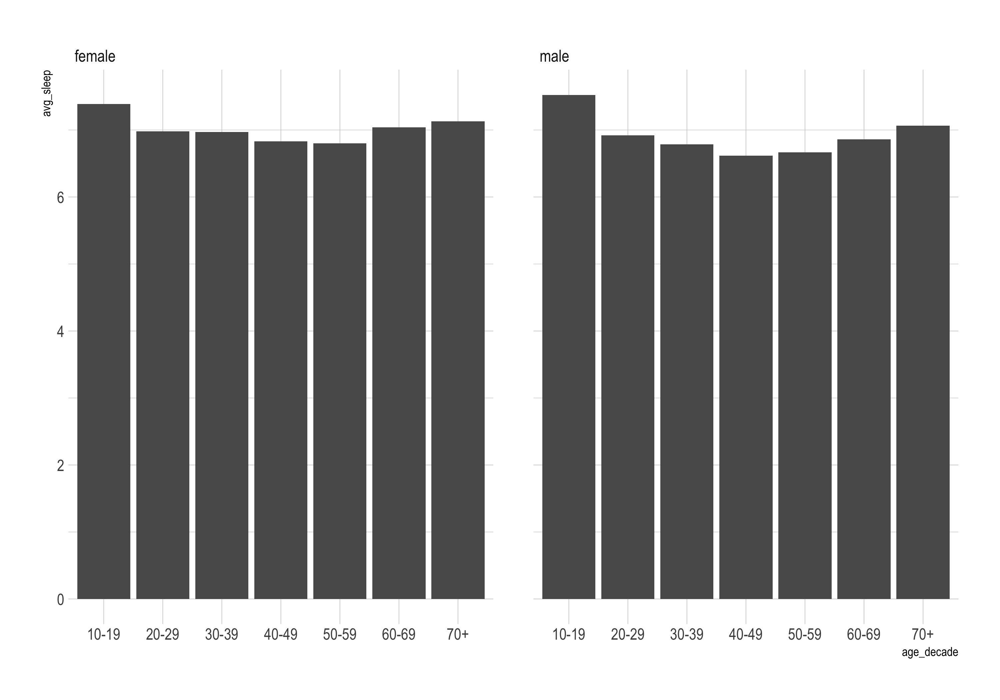

```{r setup, include=FALSE}
knitr::opts_chunk$set(echo = TRUE)
```

# Load Packages

Let's load the `tidyverse` package. 

```{r}
library(tidyverse)
```

# Import NHANES Data

Import your data into a data frame called NHANES. 

```{r}
nhanes <- read_csv("data/nhanes.csv")
```


# Scatterplot

Make a scatterplot that shows weight on the x axis and height on the y axis.

```{r}
ggplot(data = nhanes,
       mapping = aes(x = weight,
                     y = height)) +
  geom_point()
```


# Histogram 

Make a histogram that shows the distribution of the weight variable.


```{r}
ggplot(data = nhanes,
       mapping = aes(x = height)) +
  geom_histogram()
```

Copy your code from above, but adjust it so that there are 50 bins.

```{r}
ggplot(data = nhanes,
       mapping = aes(x = height)) +
  geom_histogram(bins = 50)
```

# Bar Chart

## Bar Chart v1

Use the v1 approach to make a bar chart that shows a count of the number of people who say they smoke. Include NA responses.


```{r}
ggplot(data = nhanes,
       mapping = aes(x = smoke_now)) +
  geom_bar()
```


## Bar Chart v2

I've made a new data frame called `sleep_by_gender` that shows the average amount of sleep per night that males and females report getting. 

```{r}
sleep_by_gender <- nhanes %>% 
  group_by(gender) %>% 
  summarize(avg_sleep = mean(sleep_hrs_night, na.rm = TRUE)) 
```

Plot the average amount of sleep per night for males and females.

```{r}
ggplot(data = sleep_by_gender,
       mapping = aes(x = gender,
                     y = avg_sleep)) +
  geom_bar(stat = "identity")
```


# `color` and `fill`

Take your graph from above and make the inside of each bar a different color.

```{r}
ggplot(data = sleep_by_gender,
       mapping = aes(x = gender,
                     y = avg_sleep,
                     fill = gender)) +
  geom_bar(stat = "identity")
```

Make your scatterplot from before that shows weight on the x axis and height on the y axis again, but make the dots show up in different colors based on the `phys_active` variable.

```{r}
ggplot(data = nhanes,
       mapping = aes(x = weight,
                     y = height,
                     color = gender)) +
  geom_point()
```


# Scales

## color

Take your scatterplot that you just made and add a scale using `scale_color_viridis_d`. 

```{r}
ggplot(data = nhanes,
       mapping = aes(x = weight,
                     y = height,
                     color = gender)) +
  geom_point() +
  scale_color_viridis_d()
```

Do nearly the same thing to change the color of the last bar chart you made (the one about sleep and gender). You will have to use `scale_fill_viridis_d`. 

```{r}
ggplot(data = sleep_by_gender,
       mapping = aes(x = gender,
                     y = avg_sleep,
                     fill = gender)) +
  geom_bar(stat = "identity") +
  scale_fill_viridis_d()
```


# Plot Labels

Use the code chunk from above and do the following:

1. Add a title
2. Add a better y axis label
3. Remove the x axis label

```{r}
ggplot(data = sleep_by_gender,
       mapping = aes(x = gender,
                     y = avg_sleep,
                     fill = gender)) +
  geom_bar(stat = "identity") +
  scale_fill_viridis_d() +
  labs(title = "Sleep by Gender",
       y = "Average Hours of Sleep per Night",
       x = "")
```


# Themes

Load the [`hrbrthemes` package](https://hrbrmstr.github.io/hrbrthemes/index.html). It's a package that provides some great default themes. I've installed it for you so you just need to load it.


```{r}
library(hrbrthemes)
```

Then add the `theme_ipsum` to your plot.

```{r}
ggplot(data = sleep_by_gender,
       mapping = aes(x = gender,
                     y = avg_sleep,
                     fill = gender)) +
  geom_bar(stat = "identity") +
  scale_fill_viridis_d() +
  labs(title = "Sleep by Gender",
       y = "Average Hours of Sleep per Night",
       x = "") +
  theme_ipsum()
```

# Facets

I've created a data frame called `sleep_by_gender_by_age` for you. Run the code chunk below to load the data frame and take a look at it.

```{r}
sleep_by_gender_by_age <- nhanes %>% 
  group_by(gender, age_decade) %>% 
  summarize(avg_sleep = mean(sleep_hrs_night, na.rm = TRUE)) %>% 
  drop_na()
```

Now, see if you can recreate this plot using `facet_wrap` (you can also open it from the plots directory to see it better):



```{r}
ggplot(data = sleep_by_gender_by_age,
       mapping = aes(x = age_decade,
                     y = avg_sleep)) +
  geom_bar(stat = "identity") +
  theme_ipsum() +
  facet_wrap(~gender)
```


# Save Plots

Save your last plot to a PNG that is 8 inches wide and 5 inches high. Put it in the plots directory and call it "my-sleep-plot.png"


```{r}
ggsave("plots/my-sleep-plot.png",
       width = 8,
       height = 5)
```


